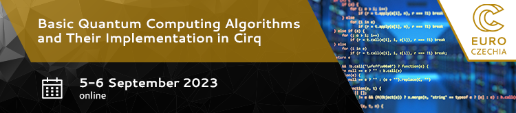

  

## Table of Contents
1. [Description](#description)
2. [Information](#information)
3. [Certificate](#certificate)

## Description

Quantum computers are based on a completely different principle than classical computers. This course aims to explain this difference by showing how basic quantum computing algorithms work in practice. It is focused on the theoretical foundations, mathematical description, and practical testing of the resulting quantum circuits.

On the first day, a brief introduction to quantum computing explanation of quantum entanglement and its applications (e.g., quantum teleportation) will be made. Then the principle of quantum superposition will be clarified, and it will be shown on Bernstein-Vazirani and Simon's algorithms how this superposition can be used in practice.

The second day will start with Grover's algorithm and then switch to the quantum Fourier transform and practical examples of its use (quantum phase estimation, Shor's algorithm).

## Information

All necessary information, links, lesson slides, and exercises for the workshop can be found [on the workshop website](https://events.it4i.cz/event/188/).
   

## Certificate
The certificate can be found [here](https://github.com/HROlive/Basic-Quantum-Computing-Algorithms-and-Their-Implementation-in-Cirq/blob/main/images/certificate.pdf).
